<!-- ============================== HEADER ============================== -->


<div align="center">

<a href="https://git.io/typing-svg">
  
</a>

<br/>

<a href="https://www.linkedin.com/in/dev-vitormanoel/"></a>
<a href="mailto:dev.vitormanoel@gmail.com"></a>


</div>


<!-- ============================== SOBRE ============================== -->
##  Sobre mim

Sou desenvolvedor full stack e o único dev da **Rei Artur Transportes Escolares**, onde projeto e mantenho do zero os sistemas internos da empresa — de um ERP de gestão de frota a automações com IA integradas ao WhatsApp. Também atendo clientes externos com soluções sob medida.

Gosto de software bem modelado: Clean Architecture, DDD e Ports & Adapters não são enfeite no meu código, são o ponto de partida. Regra de negócio no domínio, framework na borda, erro tipado de ponta a ponta.

```ts
const vitor = {
  cargo: "Desenvolvedor Full Stack @ Rei Artur Transportes Escolares",
  local: "Teresina, PI 🇧🇷",
  formacao: "Bacharel em Engenharia de Software",
  stack: {
    front: ["React", "Next.js", "TypeScript", "Tailwind"],
    back: ["Python", "FastAPI", "Node.js"],
    dados: ["PostgreSQL", "Supabase"],
    ia: ["Claude API", "OCR com human-in-the-loop"],
  },
  arquitetura: ["Clean Architecture", "DDD", "Ports & Adapters", "SoC"],
  aprendendo: ["Cibersegurança", "Docker"],
} as const;
```

<!-- ============================== STACK ============================== -->
##  Stack

<div align="center">


<br/><br/>

**Uso no dia a dia**


<br/>


<br/>

**IA & integrações**


<br/>

**Aprendendo agora**


</div>

<!-- ============================== PROJETOS ============================== -->
##  O que estou construindo

| Projeto | O que resolve | Stack | Status |
|---|---|---|---|
| 🚚 **ERP de Gestão de Frota** | ERP modular que substitui o sistema legado da operação: ordens de serviço, controle de pneus, abastecimentos, títulos a pagar, centros de custo em árvore e almoxarifado desacoplado da conciliação bancária. Atende 3 garagens. | Next.js · Supabase · PostgreSQL · Vercel | 🔒 Uso interno |
| 🤖 **Autorização de abastecimento via WhatsApp + IA** | Motoristas enviam o cupom pelo WhatsApp, a IA faz o OCR e um humano aprova antes de liberar. | Baileys · Claude API (prompt caching) · Next.js · Supabase | 🔒 Uso interno |
| 📦 **ERP para distribuidora de alimentos** | Financeiro e contas a pagar com perfis de acesso; evoluindo para contas a receber integrado ao estoque e emissão de NF-e via SEFAZ. | Next.js · Supabase · PostgreSQL | 🔒 Cliente · em evolução |
| 🎯 **JobHunter PI** | Agrega vagas de TI, classifica por dificuldade, cruza com meu perfil de skills e aponta lacunas de estudo prioritárias. | Python · FastAPI (Ports & Adapters) · React · Supabase | 🚧 Em desenvolvimento |
| 💰 **BRTFinance** | SaaS de finanças pessoais com modelo de assinatura. | Next.js · Supabase | 🚧 Em desenvolvimento |

<details>
<summary><b>📚 Projetos de estudo (2023–2024)</b></summary>
<br/>

Onde tudo começou — exercícios de fundamentos que mantenho públicos como registro da evolução.

- [Responsive-Coffee-Shop-Website](https://github.com/dev-vithor/Responsive-Coffee-Shop-Website) — site responsivo com HTML e CSS
- [login-page-responsive](https://github.com/dev-vithor/login-page-responsive) — página de login responsiva
- [validation-form](https://github.com/dev-vithor/validation-form) — validação de senha com JavaScript
- [api-movies](https://github.com/dev-vithor/api-movies) — consumo de API com TypeScript
- [reactNative-Localizacao](https://github.com/dev-vithor/reactNative-Localizacao) — geolocalização com React Native

</details>

<!-- ============================== STATS ============================== -->
##  Atividade no GitHub

<div align="center">




<br/>


<br/><br/>

<picture>
  <source media="(prefers-color-scheme: dark)" srcset="./profile/snake-dark.svg" />
  <source media="(prefers-color-scheme: light)" srcset="./profile/snake.svg" />
  
</picture>

</div>

<!-- ============================== CONTATO ============================== -->
##  Vamos conversar

<div align="center">

Aberto a oportunidades como desenvolvedor full stack, projetos sob medida e boas conversas sobre arquitetura de software.

<br/>

<a href="https://www.linkedin.com/in/dev-vitormanoel/"></a>
&nbsp;&nbsp;
<a href="mailto:dev.vitormanoel@gmail.com"></a>

</div>


